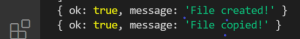
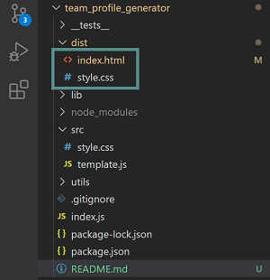

  
  
# Team Profile Generator

## Description

This application runs in the CLI (Command Line Interface) using node. The application prompts the user for information and generates an HTML file using that information. The resulting webpage is fully functional and responsive.

**Table of Contents**

  * [Installation](#installation)
  * [Usage](#usage)
  * [Contributing](#contributing)
  * [License](#license)
  * [Questions](#questions)

## Installation

To install the application please follow the proceeding directions: 

 1. install node 
    - go to [nodejs.org](#https://nodejs.org/)
    - install LTS version
 2. clone repo 
    - clone the repository onto your local desktop with the command 

        `git clone https://github.com/RochelleYounger/team_profile_generator.git`
 3. install all dependencies
    - run the command `npm install` to install all dependencies

## Usage

 - run application in terminal with `node index.js`
 - answer questions when prompted
 
    
 - copy and save generated HTML and CSS file

    
    
    

## Demo

## Contributing

All contributions are subject to review.

## License
  
  This application is licensed under [ISC](https://opensource.org/licenses/ISC).

## Questions

Github: [RochelleYounger](https://github.com/RochelleYounger)

Contact Me: [regnuoy321@gmail.com](mailto:regnuoy321@gmail.com)

---
© 2022 RochelleYounger